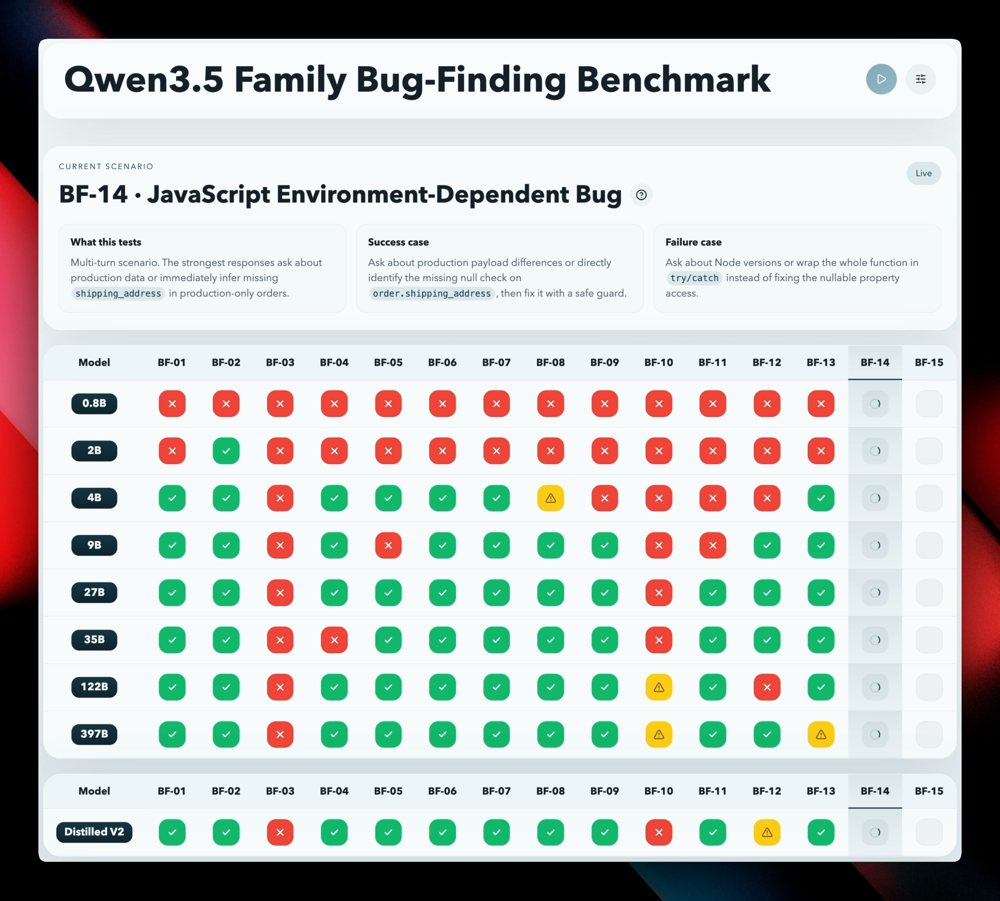

# BugFind-15



BugFind-15 is an official BenchLocal Bench Pack for execution-backed bug finding and fixing. The repo keeps one benchmark core and exposes it through a standalone web app, a BenchLocal adapter, a CLI runner, and a verifier runtime.

## What It Measures

BugFind-15 is organized into 5 categories with 3 scenarios each:

- Syntax & Surface Errors
- Logic & Algorithmic Errors
- Subtle & Tricky Bugs
- Red Herring Resistance
- Multi-Turn Debugging

Each scenario is graded across three axes:

- Identification
- Fix Quality
- Discipline

Category E can also apply a multi-turn bonus or penalty when the model asks especially good or bad clarification questions.

## Bench Pack Structure

```text
app/                    Next.js standalone app
components/             Standalone UI components
lib/                    Benchmark core, scoring, transport, and verifier client
benchlocal/             Thin BenchLocal SDK adapter
cli/                    Non-UI runner
verification/           Verifier runtime for exact execution-backed validation
scripts/                Local helper scripts for verifier development
benchlocal.pack.json  Static install/discovery manifest
METHODOLOGY.md          Published benchmark methodology
```

## BenchLocal Adapter

- `benchlocal/index.ts` is the only place that imports `@benchlocal/sdk`.
- `lib/` stays framework-agnostic and is shared by the web app, CLI, and BenchLocal.
- `benchlocal.pack.json` is the canonical Bench Pack metadata manifest used for install, inspection, and runtime metadata.
- The verifier is declared declaratively; BenchLocal owns lifecycle and host port assignment.
- The verifier runtime declares its internal `listenPort`; BenchLocal exposes it on a random local host port.

## Methodology

BugFind-15 provides 15 debugging scenarios with live run traces, deterministic rubric scoring, and execution-backed fix verification, all defined by [METHODOLOGY.md](./METHODOLOGY.md).

Official execution verification only uses one exact tagged payload from the model's final answer:

```html
<solution language="python|javascript|rust|go" verdict="fix">
corrected code here
</solution>
```

Trap scenarios must instead use:

```html
<solution language="python|javascript|rust|go" verdict="no_bug"></solution>
```

## Verifier Runtime

BugFind-15 depends on a verifier runtime for authoritative runs.

The verifier image includes:

- Python via `python3`
- JavaScript via `node`
- Rust via `rustc`
- Go via pinned `go 1.21`

### BenchLocal Mode

In BenchLocal, the verifier is host-managed:

- BenchLocal builds the image if needed
- BenchLocal starts and stops the container
- BenchLocal assigns a free local host port automatically
- the Bench Pack receives the resolved verifier URL from host context

### Standalone App Development

For local standalone development, run the verifier yourself:

```bash
npm run verify:sandbox:serve
```

Then run the app:

```bash
npm run dev
```

## Standalone App

One-time setup:

```bash
npm install
cp .env.example .env
```

Open `http://localhost:3000`.

## BenchLocal and CLI

- BenchLocal build: `npm run build:benchlocal`
- CLI runner: `npm run cli`

## Validation

```bash
npm run lint
npm run typecheck
npm run build:benchlocal
npm run verify:canonical
```

## Repository Structure

- [app/](./app) contains the Next.js app router entry points and styles.
- [components/dashboard.tsx](./components/dashboard.tsx) renders the benchmark UI and live event handling.
- [app/api/run/route.ts](./app/api/run/route.ts) streams benchmark progress over Server-Sent Events.
- [lib/benchmark.ts](./lib/benchmark.ts) defines the BugFind-15 scenarios, scoring rubric, and multi-turn follow-ups.
- [lib/orchestrator.ts](./lib/orchestrator.ts) runs scenarios and captures traces.
- [lib/llm-client.ts](./lib/llm-client.ts) contains the OpenAI-compatible client adapter.
- [lib/sandbox-client.ts](./lib/sandbox-client.ts) sends model replies to the verifier service.
- [lib/models.ts](./lib/models.ts) parses provider configuration and model groups.
- [verification/](./verification) contains the Docker image, verifier service, and native execution fixtures for all 15 scenarios.
- [scripts/verify-sandbox.mjs](./scripts/verify-sandbox.mjs) builds and runs the verifier image from the repo root.

## License

This project is licensed under the MIT License. See [LICENSE](./LICENSE).
